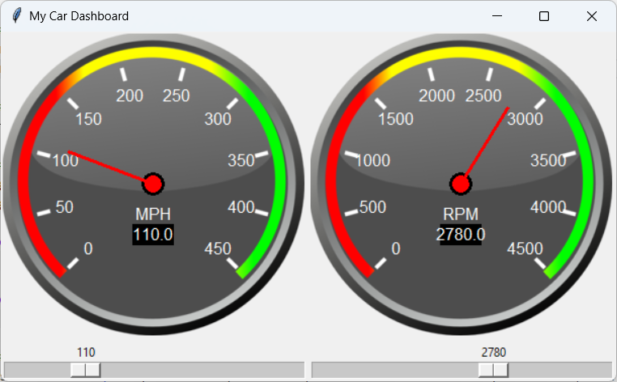

# TkGauge - Real-Time Data Visualization Widget for Tkinter

Gauge charts are an effective way to visualize real-time data, such as sensor parameters in a car engine test rig (e.g., RPM, oil pressure, temperature, etc.). However, Tkinter, a popular Python library for developing Graphical User Interfaces (GUI), lacks built-in support for such visualization widgets. 

The `TkGauge` project aims to fill this gap by providing a user-friendly and customizable gauge chart widget for Tkinter-based applications. This widget is designed to be seamlessly integrated into Tkinter applications and aligned with Tkinter's implementation architecture.



## Features

- **Real-time Data Visualization**: Display real-time data on gauge charts, allowing users to monitor changing parameters dynamically.
  
- **Customizable Appearance**: Customize the appearance of the gauge widget, including size, range, title, and initial value, to suit various application requirements.

- **Easy Integration**: Seamlessly integrate the `TkGauge` into Tkinter-based applications without the need for complex configurations.

## Installation

The `TkGauge` library can be installed via pip (project not published yet):

```
pip install TkGauge
```

## Usage

```python
import tkinter as tk
from tkGauge import TkGauge

# Create Tkinter root window
root = tk.Tk()

# Create a frame for the gauge widget
gauge_frame = tk.LabelFrame(root, text='Engine Parameters')
gauge_frame.pack()

# Create a GaugeWidget instance
my_gauge = TkGauge(gauge_frame, title="RPM", min_val=0, max_val=8000, value=3000, size=200)

# Update the gauge value (for demonstration purposes)
my_gauge.set_dial(5000)

# Start the Tkinter event loop
root.mainloop()
```

## Contributing

Contributions to the `TkGauge` project are welcome! If you find any bugs, have feature requests, or want to contribute enhancements, please open an issue or submit a pull request on the project's GitHub repository.

## License

This project is licensed under the MIT License - see the [LICENSE](LICENSE) file for details.

## Acknowledgments

- Thanks to the Tkinter community for their support and feedback.
- Special thanks to all online platforms and forums for providing valuable resources and guidance.
